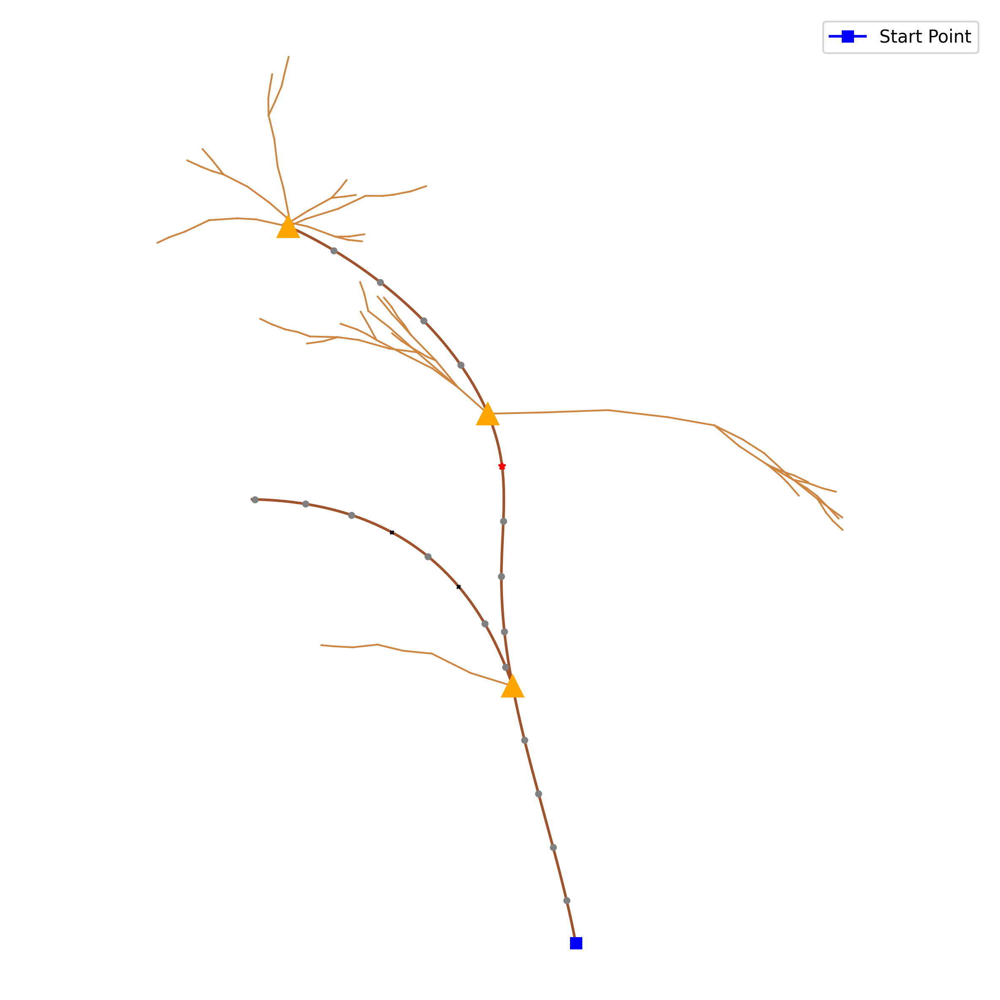
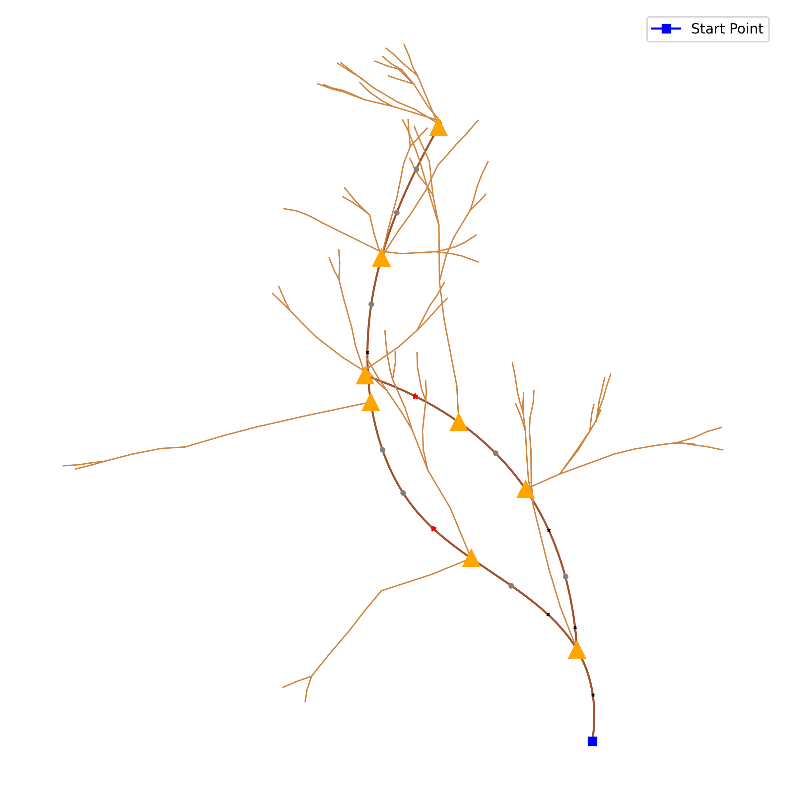
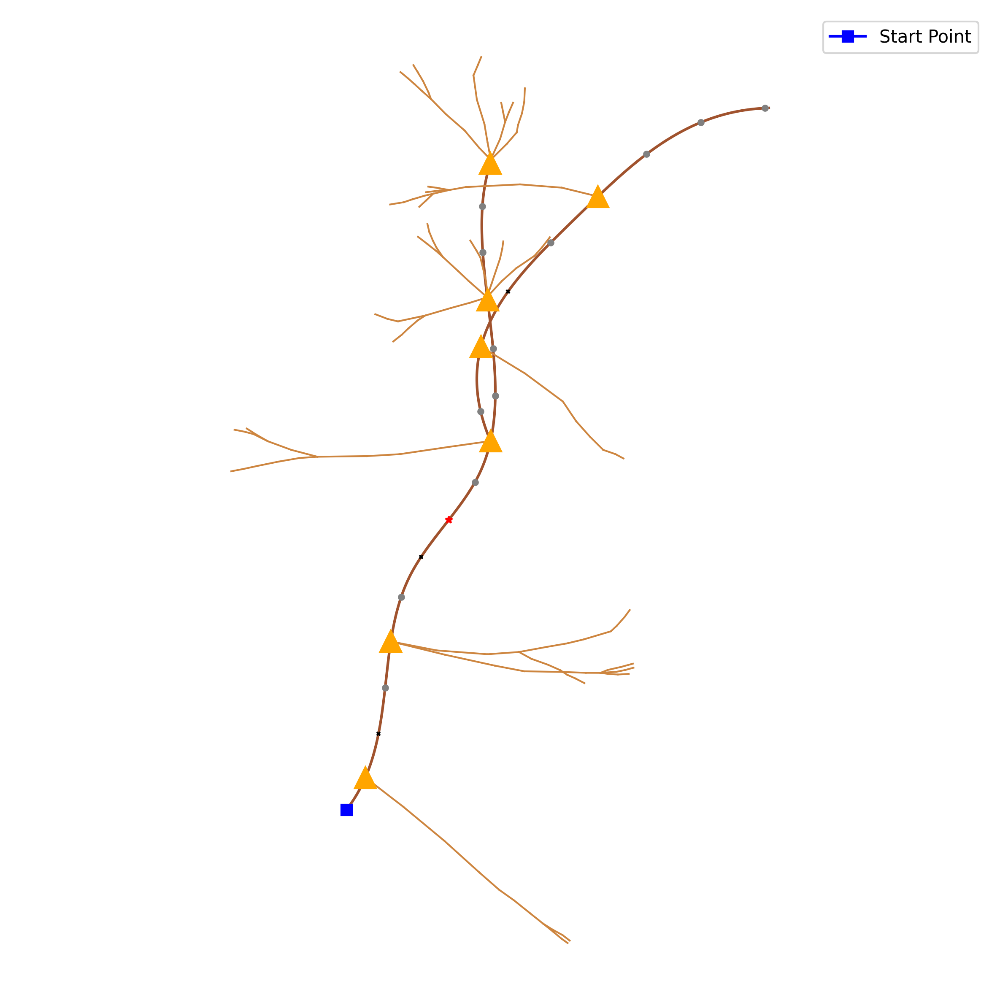

# Bonsai

## Run

python main.py

## Description

Procedural generation zen-style bonsai.

<table>
  <tr>
    <td></td>
    <td></td>
  </tr>
  <tr>
    <td></td>
    <td></td>
  </tr>
  <tr>
    <td></td>
    <td></td>
  </tr>
</table>
